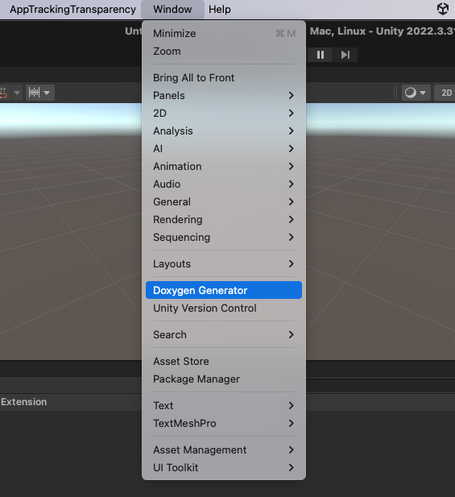
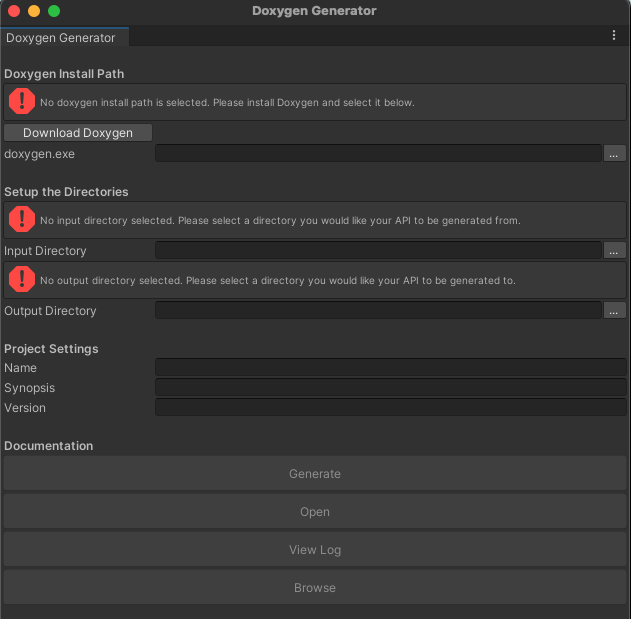

# DoxygenGenerator
A quick way to generate API documentation from inside Unity using [doxygen](https://www.doxygen.nl/index.html), with [](https://github.com/jothepro/doxygen-awesome-css) styling. Useful for generating API of your custom packages.

### Usage

1. Move the [`DoxygenGenerator`](unity/DoxygenGenerator) folder into the `Assets` folder within the Unity project. You should have something like:

   ```
   MyProject
     ├── Assets
          └── DoxygenGenerator
                 └── Editor
   ```
2. From the top menu bar in unity, navigate to **Window** > **Doxygen Generator** to open the Doxygen Generator editor window.

   |  |  |
   | -- | -- |

# DoxygenGenerator - Unity command line builder

## Variables

| Variable | Type | Description |
| --- | --- | --- |
| `doxygenGenerator_DOXYGEN_PATH` | string | Doxygen install path |
| `doxygenGenerator_INPUT_DIRECTORY` | string | Directory you would like your API to be generated from |
| `doxygenGenerator_OUTPUT_DIRECTORY` | string | Directory you would like your API to be generated to |
| `doxygenGenerator_PROJECT` | string | Project Settings - Name |
| `doxygenGenerator_SYNOPSIS` | string | Project Settings - Synopsis |
| `doxygenGenerator_VERSION` | string | Project Settings - Version |

## How to use in command line (MacOS & Linux)

```shell
export doxygenGenerator_DOXYGEN_PATH=$(which doxygen)
export doxygenGenerator_INPUT_DIRECTORY=
export doxygenGenerator_OUTPUT_DIRECTORY=
export doxygenGenerator_PROJECT=
export doxygenGenerator_SYNOPSIS=
export doxygenGenerator_VERSION=

$HOME/Applications/2022.3.31f1/Unity.app/Contents/MacOS/Unity \
-projectPath ./ \
-logFile build.log \
-executeMethod DoxygenGenerator.CommandLine.GenerateDocument \
-quit \
-accept-apiupdate \
-batchmode \
-nographics
```

## Command line builder - Independent of Platform

Use `cmd/DoxygenGenerator/Generator.sh`

### Usage

1. Copy the `cmd/DoxygenGenerator` folder into your project directory.
2. Set up the [environment variables](#variables).
3. Run the script `DoxygenGenerator/Generator.sh` to generate the documentation.

### Tested on:

- **OS:**
   
   ☑️ Windows    
   ✅ MacOS    
   ☑️ Linux    
   
- **Shell:** `zsh`, `bash`
